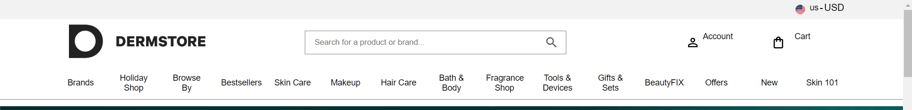
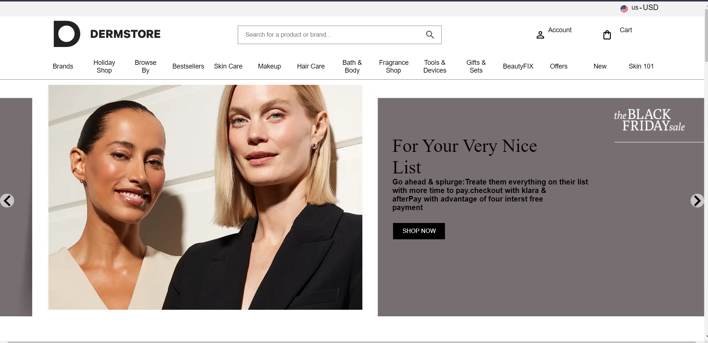
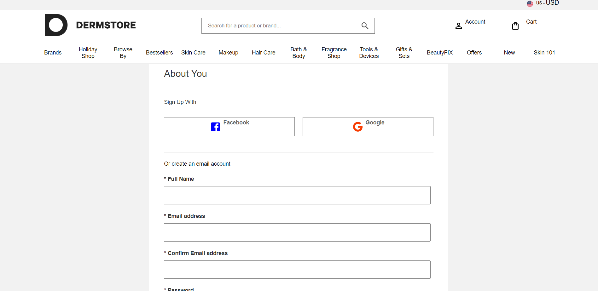
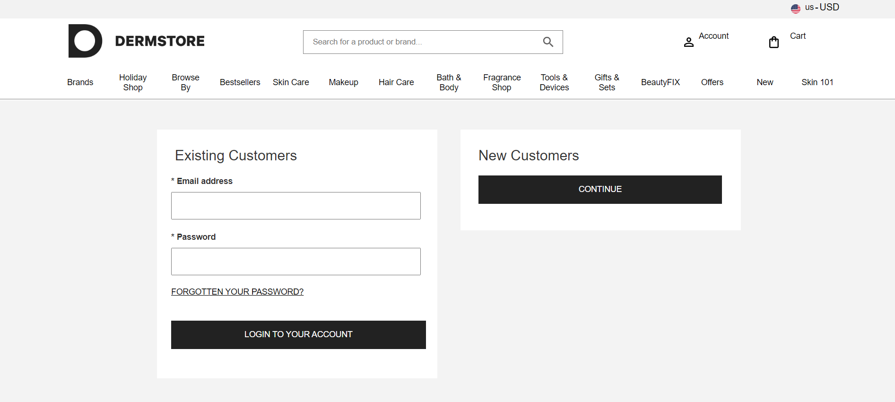
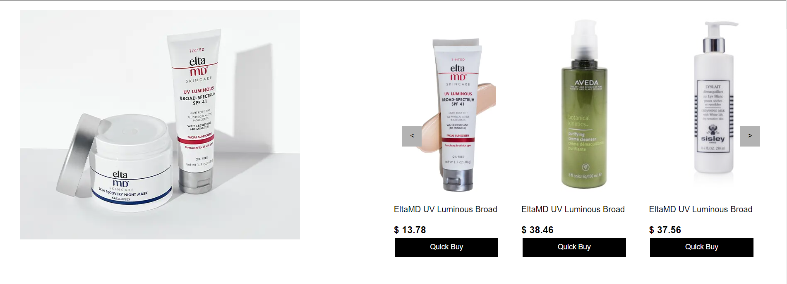
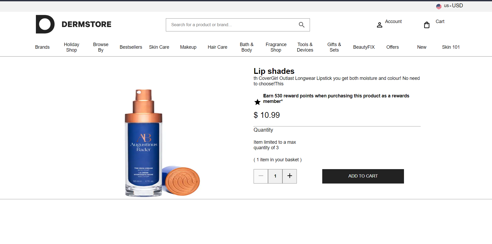
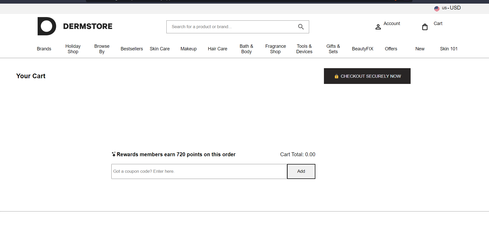
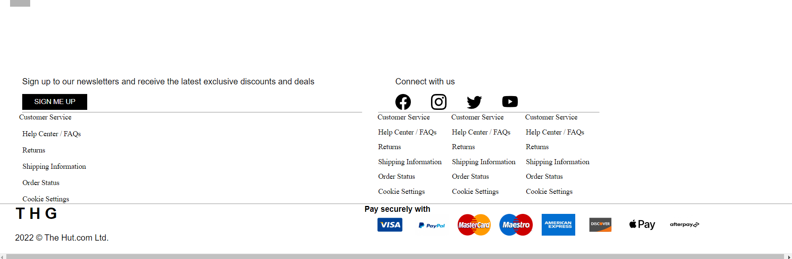

# Construct Week Project of UNIT-5

# [dermstore.com clone](https://www.dermstore.com/)

## Project code - rhetorical-cub-8075

## Project Duration ( 5 days )

- Start in 8th November 2022
- End in 12th November 2022

## Project IA Manager - [Amaresh Barik](https://github.com/amareshcoding)

## Team members

- [Girish vishveshvara Bhat](https://github.com/1Gireesh) ( Team Lead )
- [Abhijit Biswas](https://github.com/abhijitnr)
- [MOHAMMAD OSAMA](https://github.com/osamakhan9)
- [Bikram Dutta](https://github.com/bikramboss8055)
- [Rutuja Lomate](https://github.com/Rutujalomate)

## About Dermstore website

    Dermstore is US web store which sells cosmetics and skin care products. In 2021, it was acquired by THG plc from Target Corporation for £260.9m and migrated onto the company's Ingenuity e-commerce platform.

## Functionality implemented

- Navbar
- Home page
- Home page slider
- Product slider
- Search function
- Register or signup
- Login
- Add to cart
- Remove from cart
- Footer
- All the functionality like add to cart, remove from cart, seraching product all are done using backend. And Backend is build using MongoDB, Redux, NodeJS and ExpressJS.

## Deployed link of the project

- https://lambent-gumdrop-f955d9.netlify.app/ ( Deployed with backend API )
- https://flourishing-chimera-c30cfd.netlify.app/ ( Deployed without backend API you have to clone the repositories then run the backend in local system )

## Overview of the clone website

- ### Navbar
  
- ### Home page
  
- ### Register page
  
- ### Login page
  
- ### Product in home page
  
- ### Product Preview page
  
- ### Cart page
  
- ### Footer
  
